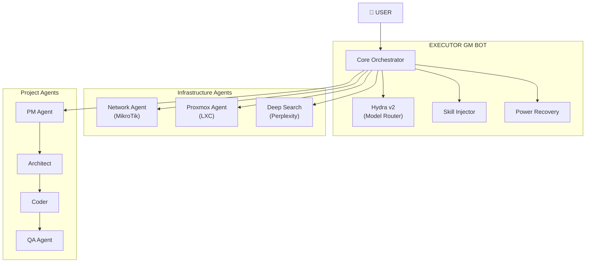
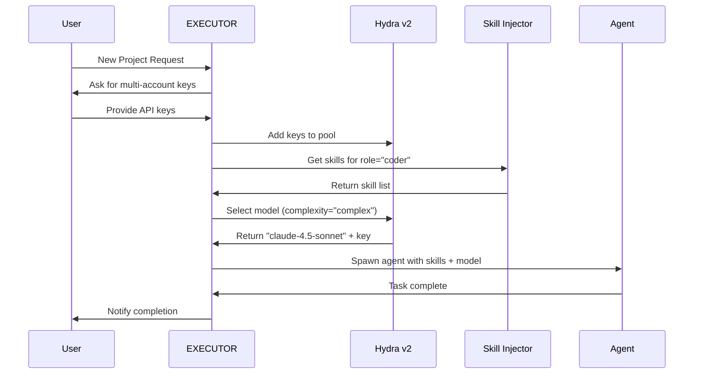

# EXECUTOR ARCHITECTURE

> **Version**: 1.0  
> **Project**: EXECUTOR GM BOT - General Manager for Antigravity Fleet  
> **Date**: 2026-02-05

---

## 1. SYSTEM OVERVIEW

EXECUTOR (General Manager Bot) is the central orchestrator for the Antigravity Fleet Multi-Agent System. It manages infrastructure agents, project agents, and handles all coordination, skill inheritance, and model routing.



---

## 2. CORE COMPONENTS

### 2.1 Orchestrator (`core/orchestrator.py`)

**Responsibilities:**
- Fleet coordination and task assignment
- Health monitoring of all agents
- Power recovery protocol execution
- User escalation when critical decisions needed

**Key Methods:**
- `run()` - Main execution loop
- `power_recovery_check()` - Scan agents after restart
- `ask_user_multi_account()` - Request API keys from User

---

### 2.2 Hydra Protocol v2 (`core/model_router.py`)

**Purpose:** Multi-model routing with automatic account rotation.

**Features:**
1. **Model Registry** - Categorizes models into tiers:
   - FREE (OpenCode, Google AI Studio free tier)
   - STANDARD (Gemini Flash, GPT-4o Mini)
   - PREMIUM (Claude Sonnet, GPT-4o)
   - CRITICAL (Claude Opus - requires user approval)

2. **Account Rotation**:
   - Round-robin or random key selection
   - Automatic fallback when rate limited
   - Usage tracking per key

3. **Fallback Chain**:
   ```
   Claude Opus → Claude Sonnet → Gemini Pro → OpenCode (free)
   ```

**Key Methods:**
- `select_model()` - Choose model based on complexity & budget
- `select_with_fallback()` - Guaranteed availability with fallback
- `mark_rate_limited()` - Handle 429 errors

---

### 2.3 Skill Injector (`core/skill_injector.py`)

**Purpose:** Distribute appropriate skills to child agents based on their role.

**Skill Distribution:**

| Agent Role | Skills Injected |
|------------|----------------|
| **PM Agent** | openspec, writing-plans, pricing-strategy, marketing-ideas |
| **Architect** | mcp-builder, mermaid-diagrams, supabase-postgres-best-practices |
| **Coder** | vercel-react-best-practices, test-driven-development, systematic-debugging |
| **QA Agent** | qa-test-planner, webapp-testing, systematic-debugging |
| **Network Agent** | systematic-debugging, mikrotik_architect |
| **Proxmox Agent** | mcp-builder, systematic-debugging |
| **Deep Search** | brainstorming, writing-clearly-and-concisely |

**Key Methods:**
- `get_skills_for_role()` - Get skill list for a role
- `generate_system_prompt()` - Build complete prompt with skills + rules
- `inject_to_agent()` - Inject into agent config

---

### 2.4 Power Recovery (`core/power_recovery.py`)

**Purpose:** Resume operations after power outage.

**Workflow:**
1. Detect interruption (check `last_state.json`)
2. Load checkpoints for all agents
3. Ping each agent to verify status
4. Generate recovery report
5. Send to User via Telegram + Discord

**Key Methods:**
- `save_checkpoint()` - Save agent state periodically
- `load_checkpoint()` - Load last known state
- `recover()` - Full system recovery scan

---

## 3. AGENT TYPES

### 3.1 Infrastructure Agents

**Network Agent (MikroTik Expert)**
- Model: Claude Opus 4.5 (via Google AI Pro)
- API: `routeros_api`
- Commands: Firewall, NAT, VPN, Bandwidth management

**Proxmox Agent (LXC Provisioner)**
- Model: Claude Opus 4.5 (via Google AI Pro)
- API: `proxmoxer`
- Commands: Create/Delete LXC, Snapshots, Resource allocation

**Deep Search Agent (SPY)**
- Model: Perplexity API
- Purpose: Deep research when agents need external information

---

### 3.2 Project Agents

Follow ChatDev/MetaGPT patterns:

```
PM → Architect → Coder → QA → [Loop until pass]
```

Each agent type has specialized skills and escalation rules. See `project_agents_architecture.md` for details.

---

## 4. DATA FLOW



---

## 5. CONFIGURATION

### 5.1 Config Files

**`config/hydra_keys.json`**
```json
{
  "keys": [
    {
      "provider": "google-ai-pro",
      "key": "YOUR_API_KEY",
      "tier": "premium"
    }
  ],
  "rotation_strategy": "round_robin",
  "fallback": "opencode"
}
```

**`config/notification.json`**
```json
{
  "telegram": {
    "enabled": true,
    "bot_token": "YOUR_BOT_TOKEN",
    "chat_id": "YOUR_CHAT_ID"
  },
  "discord": {
    "enabled": true,
    "webhook_url": "YOUR_WEBHOOK_URL"
  }
}
```

**`config/fleet_registry.json`**
```json
{
  "agents": [
    {
      "id": "network-001",
      "name": "Network Agent",
      "type": "infrastructure",
      "status": "online"
    }
  ]
}
```

---

## 6. ERROR HANDLING

### 6.1 Model Unavailability (503 Errors)

**Problem:** Claude Opus frequently returns `503 UNAVAILABLE - No capacity available`.

**Solution:** Automatic fallback chain in `select_with_fallback()`:
1. Try Claude Opus
2. Fallback to Claude Sonnet
3. Fallback to Gemini Pro
4. Last resort: OpenCode (free)

### 6.2 Rate Limiting (429 Errors)

**Solution:** Hydra v2 automatically switches to next key in pool.

### 6.3 Network Failures

**Solution:** Retry 3 times, then fallback to next model tier.

---

## 7. SECURITY

- API keys stored in `config/hydra_keys.json` (should be encrypted)
- `.gitignore` configured to exclude sensitive files
- Telegram/Discord webhooks stored separately

---

## 8. SCALABILITY

**Current Capacity:**
- Supports unlimited Infrastructure Agents
- Projects spawn new LXC containers dynamically
- Model routing handles multiple concurrent requests

**Limitations:**
- Single EXECUTOR instance (no HA yet)
- SQLite for state (consider Postgres for production)

---

## 9. FUTURE ENHANCEMENTS

1. **High Availability**: Multiple EXECUTOR instances with leader election
2. **Distributed State**: Move from SQLite to Postgres/Redis
3. **Metrics Dashboard**: Real-time monitoring of agent health
4. **Auto-Scaling**: Spawn more Project Agents based on workload
5. **Encrypted Secrets**: Vault integration for API keys

---

*For detailed Project Agent specs, see the companion document: project_agents_architecture.md*
